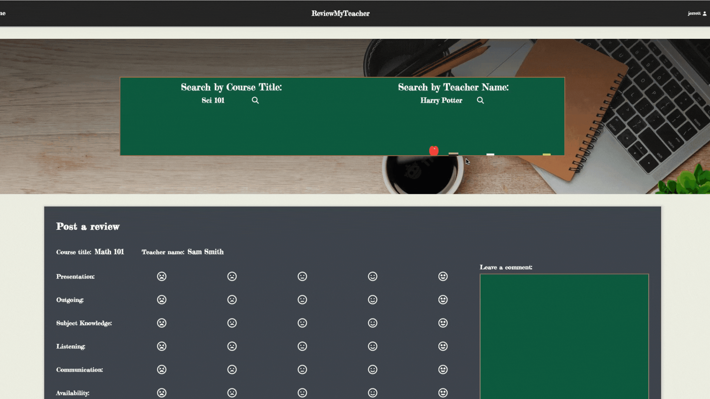
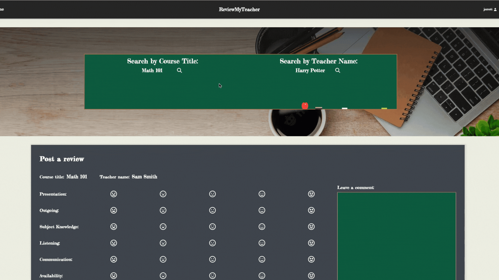
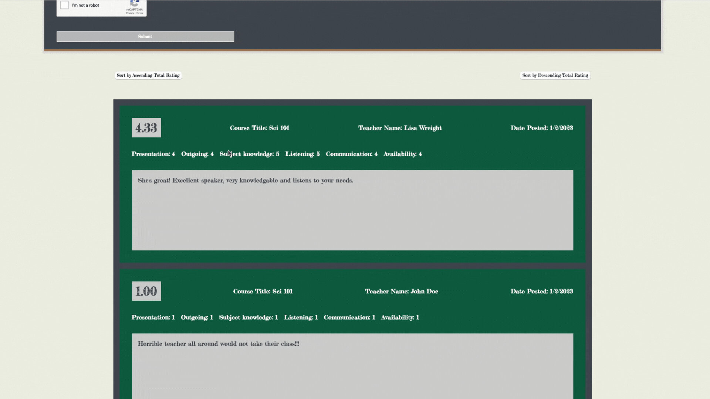

# ATA-Learn-And-Be-Curious-Project - Team 6

# Review My Teacher

#### Contributors: Brandon Clark, Jonathan Sepik, Jerrett Gonsalves

#### Languages used:
- Java
- Javascript
- HTML
- CSS
#### Technologies and frameworks used:
- Auth0
- AWS DynamoDB
- Express.js
- Node.js
- Spring Boot
- Webpack
### About:

This application serves as a tool for students that are selecting teachers for courses by
providing them with reviews made by students who are currently enrolled or have taken a teacher's class. 
Students are able to make an informed decision about which teacher to enroll with based off of previous reviews
which contain ratings in numerous categories and (optional) comments.

### Features:
 - Creating a review for a teacher
 - Editing a review for a teacher (if user was logged in at creation)
 - Deleting a review for a teacher (if user was logged in at creation)
 - Searching all reviews for a teacher
 - Searching all reviews for all teachers by a course
 - Retrieve all reviews a logged-in user made while logged in
 - Sort reviews by total rating in ascending/descending order

### Expansion:
 - Allowing for different schools to be a part of the reviews
 - Using Auth0 for authorization so admins/moderators can remove inappropriate reviews
 - Allowing admins to control relationships between schools, courses, teachers

### Demo:

#### Creating a review

#### Editing a review

#### Deleting a review

#### Searching all reviews for a teacher

#### Searching all reviews for all teachers by a course

#### Sort reviews by total rating in ascending/descending order
